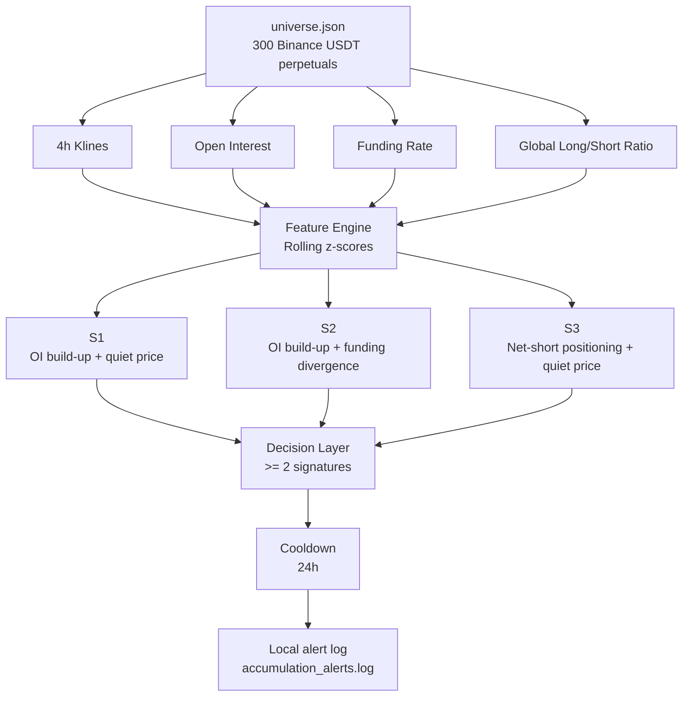

# Crypto Accumulation Scanner

A rule-based monitoring system for detecting **accumulation-like structures** in Binance USDT perpetual markets.

The system scans 300 selected perpetual contracts every 4 hours and looks for situations where **Open Interest (OI) rises while price remains relatively quiet**, combined with funding-rate and long/short positioning signals.

It is designed to answer:

> **Which tokens currently deserve further research because their market structure looks unusual?**

It does **not** predict price direction, place trades, or generate investment advice.

---

## 1. What the system does

For each token, the scanner collects four dimensions:

- **Open Interest (OI)**
- **4h Price Range**
- **Funding Rate**
- **Global Long / Short Account Ratio**

Each dimension is converted into a **z-score relative to its own recent history**.

The scanner then evaluates three accumulation signatures:

| Signature | Logic |
|---|---|
| **S1 — OI build-up + quiet price** | OI is unusually high and price range is unusually narrow |
| **S2 — OI build-up + funding divergence** | OI is unusually high while funding remains at or below its normal level |
| **S3 — Net-short positioning + quiet price** | Long/short positioning is unusually low while price remains quiet |

A token is flagged only when **at least 2 of the 3 signatures are satisfied**.

The OI condition must also remain elevated for **6 consecutive 4-hour windows (≈24 hours)**.

---

## 2. Universe construction

The scanner monitors **300 Binance USDT perpetual contracts**.

The universe is generated by `build_universe.py`:

1. Retrieve all active USDT perpetual contracts from Binance.
2. Rank them by **24-hour quote volume**.
3. Exclude the top 100 highest-volume contracts.
4. Keep the next 300 eligible contracts.
5. Save the result to `universe.json`.

The universe is based on **Binance 24-hour quote-volume ranking**.

Refresh the universe with:

```bash
python build_universe.py
```

---

## 3. Signal methodology

For each metric:

```text
z(t) = [x(t) - mean(baseline)] / std(baseline)
```

The current implementation uses a 4-hour scan cycle and approximately one week of historical data for the baseline.

### S1 — OI build-up + quiet price

```text
OI z-score >= 2.0
AND
OI condition persists for >= 6 consecutive windows
AND
4h price-range z-score <= -1.0
```

Interpretation:

> Leverage / positioning is building while price remains relatively compressed.

### S2 — OI build-up + funding divergence

```text
OI z-score >= 2.0
AND
OI condition persists for >= 6 consecutive windows
AND
Funding-rate z-score <= 0
```

Interpretation:

> OI is elevated without a corresponding extreme positive funding premium.

### S3 — Net-short positioning + quiet price

```text
Long/short ratio z-score <= -1.5
AND
4h price-range z-score <= -1.0
```

Interpretation:

> Positioning becomes unusually short while price remains compressed.

### Final trigger

```text
number of satisfied signatures >= 2
```

A 24-hour cooldown is applied to avoid repeatedly reporting the same token.

---

## 4. System architecture



The project is intentionally simple:

```text
build_universe.py
        ↓
   universe.json
        ↓
accumulation_scanner.py
        ↓
accumulation_alerts.log

run_scanner_loop.py
        ↓
runs accumulation_scanner.py every 4 hours
```

---

## 5. Quick start

Install the only third-party dependency:

```bash
pip install requests
```

Build or refresh the token universe:

```bash
python build_universe.py
```

Run one scan:

```bash
python accumulation_scanner.py
```

Run continuously every 4 hours:

```bash
python run_scanner_loop.py
```

The scanner writes detected signals to:

```text
accumulation_alerts.log
```

Runtime state is stored locally in:

```text
alert_state.json
```

No API key or private configuration file is required by the current scanner.

---

## 6. Project structure

```text
crypto-resonance-monitor/
├── README.md
├── accumulation_scanner.py
├── build_universe.py
├── run_scanner_loop.py
├── universe.json
├── .gitignore
└── docs/
    └── accumulation_method.md
```

### Core files

**`build_universe.py`**

Builds the 300-token monitoring universe from Binance market data.

**`accumulation_scanner.py`**

Core signal engine. Fetches market data, calculates z-scores, evaluates S1/S2/S3, and records alerts.

**`run_scanner_loop.py`**

Simple scheduler that runs the scanner every 4 hours.

**`universe.json`**

Current list of 300 monitored Binance USDT perpetual contracts.

**`docs/accumulation_method.md`**

Detailed methodology and assumptions behind the signal design.

---

## 7. Current parameters

| Parameter | Value |
|---|---:|
| Scan interval | 4 hours |
| Universe size | 300 |
| OI z-score threshold | 2.0 |
| OI persistence | 6 × 4h windows |
| Quiet-price threshold | -1.0 z |
| Funding threshold | 0 z |
| Long/short threshold | -1.5 z |
| Minimum signatures | 2 / 3 |
| Alert cooldown | 24 hours |

These parameters are treated as **initial frozen assumptions**, not parameters optimized on individual tokens.

---

## 8. Design principles

### Relative rather than absolute signals

Different tokens have very different volatility and positioning characteristics.

Using each token's own historical distribution makes the signals more comparable across the universe.

### Multi-dimensional confirmation

A single unusual metric can be noisy.

The scanner therefore requires multiple signatures to agree before flagging a token.

### Detection rather than prediction

The system is designed to identify:

> **"This token currently looks structurally unusual and deserves further research."**

It is not designed to answer:

> "This token will go up."

### Human-in-the-loop

The scanner is a **research screening tool**, not an execution system.

The intended workflow is:

```text
Market data
    ↓
Rule-based screening
    ↓
Candidate tokens
    ↓
Human research
    ↓
Independent decision
```

---

## 9. Limitations

- Data comes from **Binance only**, so cross-exchange positioning is not captured.
- The system uses public REST APIs and depends on network/API availability.
- Some metrics may be unavailable for individual contracts.
- A strong OI signal does not necessarily mean accumulation; it may also reflect leverage, hedging, or speculative positioning.
- The current rules are hypotheses that require continued observation and validation.
- The scanner does not model transaction costs, execution quality, or portfolio construction.

---

## 10. Status

**Current version: rule-based accumulation screening prototype.**

The project currently focuses on building a reliable market-structure screening pipeline.

It is deliberately separated from automated trading or autonomous decision-making. Any future agent layer should be added on top of the screening system rather than mixed into the core signal logic.

---

> This project is for research and educational purposes only. It does not constitute investment advice.